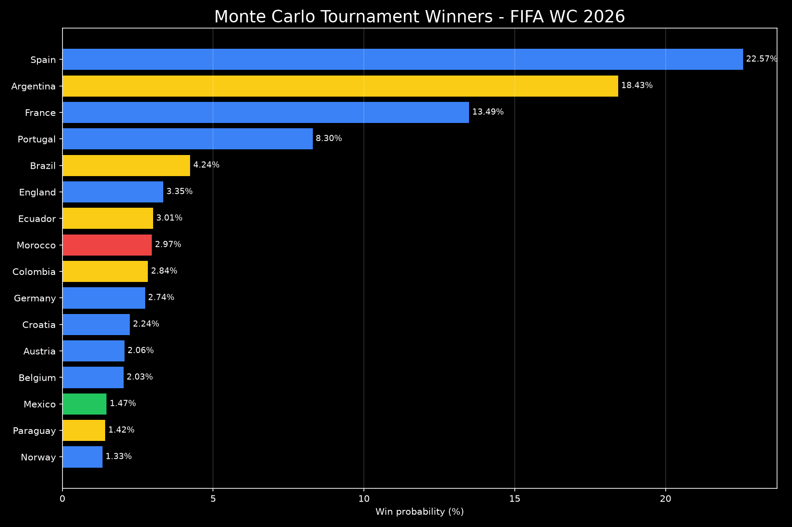
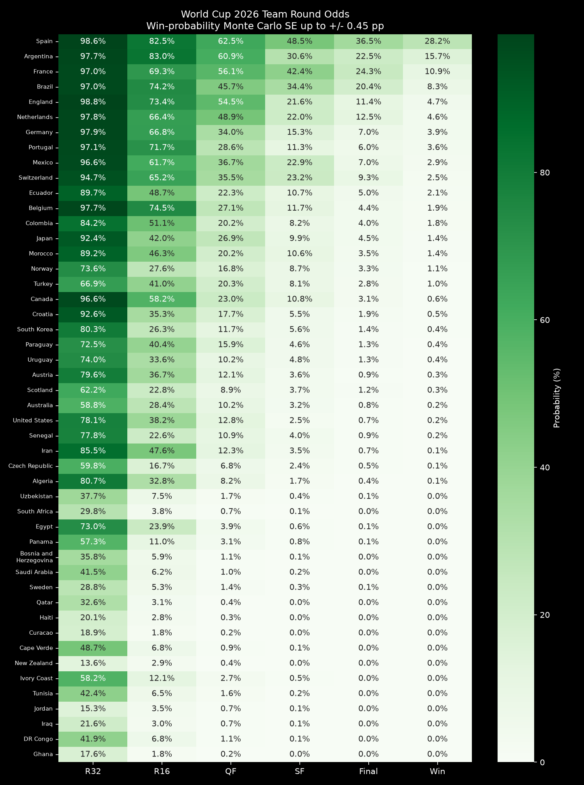
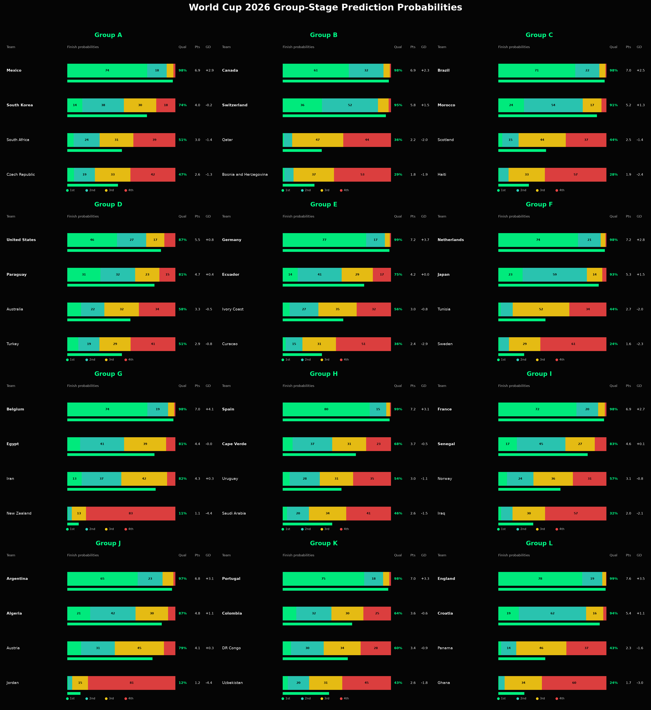
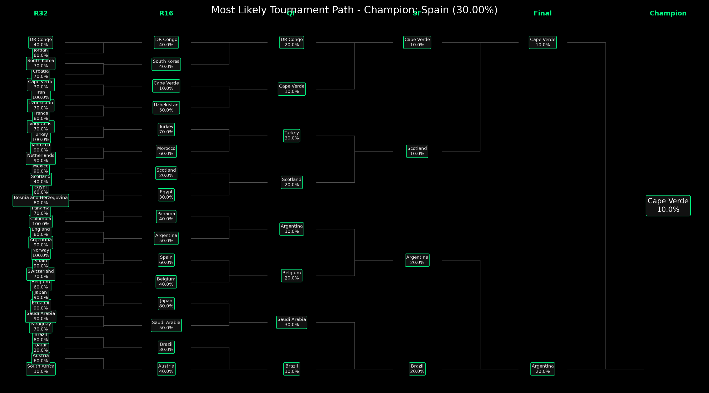
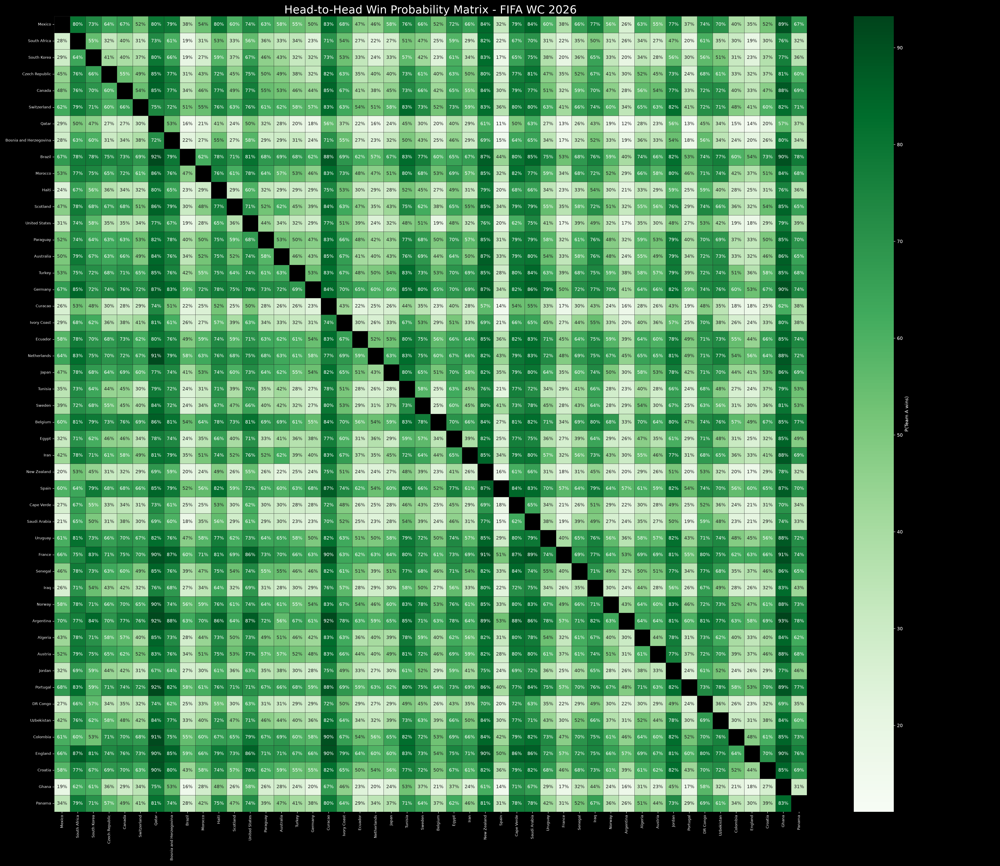
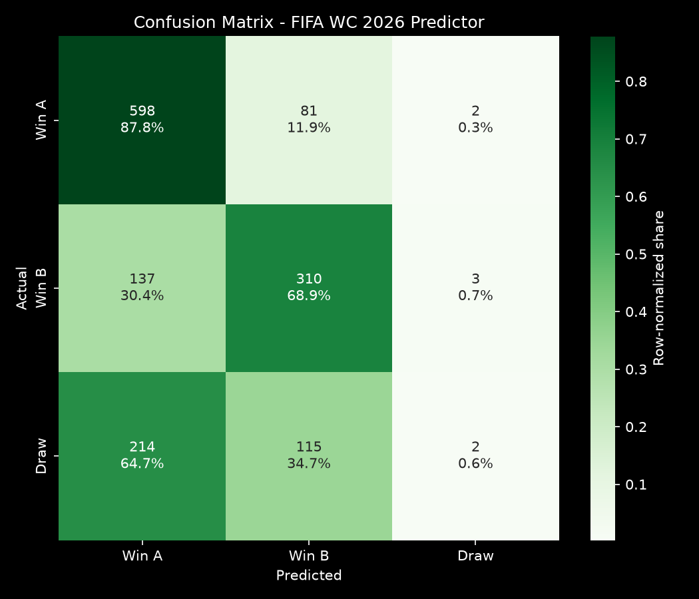

# WC 2026 Predictor

Machine-learning match prediction and Monte Carlo tournament simulation for the FIFA World Cup 2026.




## What is this?

`wc2026-predictor` trains a match-outcome model from historical international results, ELO ratings, and optional player-strength data, then simulates the 48-team 2026 World Cup bracket thousands of times.

The project is designed to be practical and reproducible:

| What you get | Where it lives |
|---|---|
| Calibrated win/draw/loss model | `src/model.py` |
| 2026 group and bracket simulator | `src/simulate.py` |
| Config-backed tournament format | `data/config/wc2026_groups.yml` |
| CSV/JSON outputs for analysis | `outputs/` |
| PNG charts for reports/GitHub | `visualizations/` |
| Tests and CI smoke coverage | `tests/`, `.github/workflows/smoke.yml` |

## Current snapshot

The committed outputs were generated with:

```bash
python main.py --simulations 10000 --skip-player-features --seed 42
```

Top tournament win probabilities from `outputs/simulation_results.csv`:

| Team | Win | Final |
|---|---:|---:|
| Spain | 28.21% | 36.47% |
| Argentina | 15.74% | 22.49% |
| France | 10.94% | 24.34% |
| Brazil | 8.33% | 20.43% |
| England | 4.67% | 11.39% |

Simulation integrity checks for the saved run:

| Round | Expected entrants | Saved count |
|---|---:|---:|
| Round of 32 | 320,000 | 320,000 |
| Round of 16 | 160,000 | 160,000 |
| Quarterfinal | 80,000 | 80,000 |
| Semifinal | 40,000 | 40,000 |
| Final | 20,000 | 20,000 |
| Champion | 10,000 | 10,000 |

## How does it work?

1. Load and clean historical match results and ELO ratings.
2. Build leakage-safe rolling features using only data available before each match.
3. Train a soft-voting ensemble and calibrate its probabilities on a chronological holdout.
4. Simulate group-stage matches with draws allowed.
5. Select the top two teams from every group plus the eight best third-place teams.
6. Resolve knockout rounds with advancement probabilities and a Poisson scoreline model.
7. Save CSV/JSON artifacts and regenerate visualizations from those artifacts.

## Quickstart

```bash
git clone https://github.com/joeycatic/wc2026-predictor.git
cd wc2026-predictor
pip install -r requirements.txt
python main.py --simulations 250 --skip-player-features --seed 42
```

Use the full default run:

```bash
python main.py --simulations 10000 --skip-player-features --seed 42
```

Use Kaggle/Sofifa player ratings when available:

```bash
python scripts/download_data.py --datasets all
python main.py --simulations 10000 --use-player-features --seed 42
```

## Useful commands

| Command | Purpose |
|---|---|
| `python main.py --simulations 10000 --skip-player-features --seed 42` | Train, evaluate, simulate, and plot with reproducible base features. |
| `python main.py --use-player-features --seed 42` | Add player-strength aggregates when local Kaggle data exists. |
| `python main.py --no-train --simulations 10000` | Load `outputs/ensemble_model.pkl` and rerun simulations. |
| `python main.py --visualize-only` | Rebuild PNGs from saved CSV/JSON artifacts. |
| `python main.py --data-status` | Print input coverage, latest dates, optional priors, and missing teams. |
| `python main.py --scoreline-model legacy` | Use the old constrained scoreline sampler instead of Poisson. |

## What data is needed?

Place raw CSVs under `data/raw/`.

Required match results:

| Supported path | Required columns |
|---|---|
| `data/raw/wc_results.csv` | `date`, `home_team`, `away_team`, `home_score`, `away_score`, `tournament` |
| `data/raw/footballresults/results.csv` | same as above |

Required ELO ratings:

| Supported path | Required columns |
|---|---|
| `data/raw/elo_ratings.csv` | `date`, `team`, `elo_rating` |
| `data/raw/eloratings.csv` | `date`, `team`, `rating` also works |

Optional local priors:

| File | Schema |
|---|---|
| `data/raw/fifa_rankings.csv` | `date`, `team`, `rank`, optional `points` |
| `data/raw/betting_odds.csv` | `date`, `team`, `win_odds` or `implied_win_probability`, optional `market` |
| `data/raw/wc2026_fixtures.csv` | `date`, `stage`, `home_team`, `away_team`, optional `venue`, `city`, `country` |

If optional files are missing, the pipeline records that in `outputs/metrics.json` and continues.

## Player features

`src/player_features.py` can aggregate Sofifa/FIFA player snapshots by national team and season. It creates squad-strength features such as top-15 overall rating, top-5 position-group strength, squad age, international reputation, market value, and depth score.

Historical rows use the latest player snapshot strictly before the match year. The 2026 simulation uses the latest available snapshot. If player data is missing, `--use-player-features` logs a warning and uses neutral fallback values.

## Model and validation

The model is a soft-voting classifier:

| Estimator | Role |
|---|---|
| `GradientBoostingClassifier` | Nonlinear match-outcome signal |
| `RandomForestClassifier` | Robust tree baseline inside the ensemble |
| `MLPClassifier` | Lightweight neural component |

Validation is chronological. The pipeline reports:

- Accuracy and macro F1
- Log loss and multiclass Brier score
- Expected calibration error
- Before/after calibration metrics
- Confusion matrix
- Baseline model comparisons
- Team and confederation error diagnostics
- FIFA World Cup historical backtest summary

## Outputs

After running `python main.py`, analytical artifacts are written to `outputs/`.

| Artifact | Path |
|---|---|
| Main metrics | `outputs/metrics.json` |
| Baseline metrics | `outputs/baseline_metrics.json` |
| Feature importance | `outputs/feature_importance.csv` |
| Feature matrix | `data/processed/match_features.csv` |
| Simulation summary | `outputs/simulation_results.csv` |
| Group-stage probabilities | `outputs/group_stage_predictions.csv` |
| Most-likely group tables | `outputs/group_most_likely_tables.csv` |
| Bracket slot probabilities | `outputs/bracket_slot_probabilities.csv` |
| Round counters | `outputs/round_counts.json` |
| Path counters | `outputs/path_counts.json` |
| Historical backtest | `outputs/backtest_results.csv` |
| Error analysis | `outputs/error_analysis.csv` |

Model binaries are intentionally ignored by Git:

```text
outputs/ensemble_model.pkl
outputs/label_encoder.pkl
```

## Visualizations











Additional generated plots:

- `visualizations/monte_carlo_winners.png`
- `visualizations/radar_team_strengths.png`
- `visualizations/group_most_likely_tables.png`
- `visualizations/calibration_curves.png`
- `visualizations/backtest_summary.png`
- `visualizations/error_analysis.png`

## Project layout

```text
wc2026-predictor/
|-- main.py
|-- README.md
|-- requirements.txt
|-- data/
|   |-- config/wc2026_groups.yml
|   |-- processed/match_features.csv
|   `-- raw/
|-- outputs/
|-- visualizations/
|-- scripts/download_data.py
|-- src/
|   |-- backtest.py
|   |-- features.py
|   |-- model.py
|   |-- optional_data.py
|   |-- player_features.py
|   |-- preprocessing.py
|   |-- simulate.py
|   `-- tournament.py
`-- tests/
```

## Development checks

```bash
python -m ruff check .
python -m pytest
python main.py --simulations 10 --skip-player-features --seed 42
python main.py --visualize-only
python main.py --data-status
```

CI runs Ruff, pytest, and a deterministic smoke simulation without requiring Kaggle credentials.

## Why this project?

The goal is not just to pick a winner. The useful part is the full probability surface: group qualification odds, bracket slot likelihoods, finalist paths, backtest quality, and calibration diagnostics that make the predictions easier to audit.

## License

MIT License.
