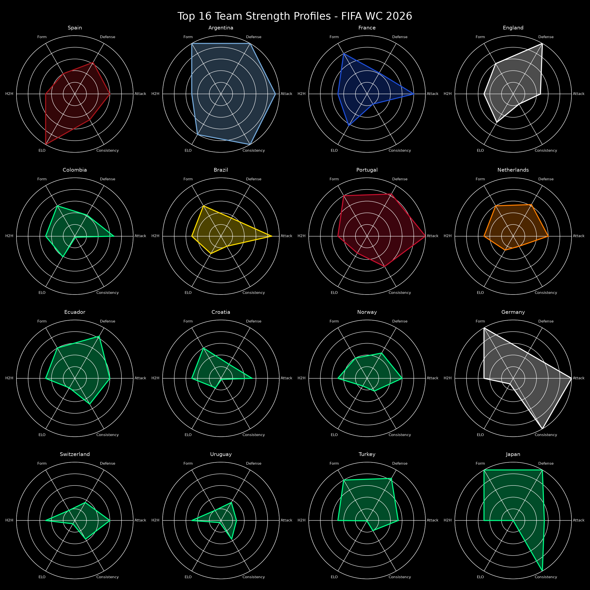

# WC 2026 Predictor

Machine-learning match outcome prediction and Monte Carlo tournament simulation for the FIFA World Cup 2026.


## Overview

`wc2026-predictor` is a self-contained Python project for predicting international football match outcomes. It combines historical match results with ELO ratings, trains a soft-voting ensemble, evaluates it with chronological validation, and simulates the 48-team 2026 World Cup format.

The pipeline is designed to run from a fresh clone with one command after dependencies and raw CSVs are available.

## Features

- Leakage-safe rolling features computed strictly before each match date.
- ELO-based strength features and head-to-head history.
- Optional Kaggle/Sofifa player-rating aggregates joined by latest snapshot before match year.
- Soft-voting ensemble with Gradient Boosting, Random Forest, and MLP classifiers.
- Chronological 80/20 train/test split, `TimeSeriesSplit` validation, log loss, Brier score, and calibration metrics.
- 10,000-run Monte Carlo tournament simulation by default.
- Config-backed 2026 groups and bracket slots in `data/config/wc2026_groups.yml`.
- High-resolution dark-theme visualizations for GitHub and reports.

## Quickstart

```bash
git clone https://github.com/yourname/wc2026-predictor
cd wc2026-predictor
pip install -r requirements.txt
python main.py --simulations 250 --skip-player-features
```

With Kaggle player ratings:

```bash
python scripts/download_data.py --datasets all
python main.py --simulations 10000 --use-player-features
```

## Dataset Setup

Place raw CSVs in `data/raw/`. The loader supports both the prompt names and the current repository layout:

- `data/raw/wc_results.csv` or `data/raw/footballresults/results.csv`
- `data/raw/elo_ratings.csv` or `data/raw/eloratings.csv`

Expected match columns are `date`, `home_team`, `away_team`, `home_score`, `away_score`, `tournament`, and optionally `stage`. Expected ELO columns are `date`, `team`, and `elo_rating`; a `rating` column is automatically renamed.

### Kaggle Setup

Install dependencies, create a Kaggle API token from your Kaggle account settings, and place it at `~/.kaggle/kaggle.json` with permissions readable only by your user:

```bash
chmod 600 ~/.kaggle/kaggle.json
python scripts/download_data.py --datasets all
```

The downloader fetches:

- `stefanoleone992/fifa-23-complete-player-dataset` for Sofifa/FIFA player ratings used as pre-match strength proxies.
- `rhugvedbhojane/fifa-world-cup-2022-players-statistics` for notebook and visual exploration only.

Raw Kaggle files stay in `data/raw/`, which is ignored by Git. The model uses the processed aggregate `data/processed/team_player_features.csv`.

## Player Features

`src/player_features.py` aggregates player snapshots by national team and season. Features include average overall rating, top-15 overall rating, top-5 attack/midfield/defense/goalkeeper strength, squad age, international reputation, value, weak-foot and skill-move averages, and depth score.

Historical training rows use the latest player snapshot strictly before the match year. The 2026 simulation uses the latest available snapshot as a current squad-strength proxy. If player data is missing, `--use-player-features` logs a warning and fills neutral values so the pipeline still runs.

## Project Structure

```text
wc2026-predictor/
├── README.md
├── requirements.txt
├── .gitignore
├── data/
│   ├── raw/
│   │   ├── wc_results.csv
│   │   └── elo_ratings.csv
│   ├── config/
│   │   └── wc2026_groups.yml
│   └── processed/
│       ├── .gitkeep
│       ├── match_features.csv
│       └── team_player_features.csv
├── scripts/
│   └── download_data.py
├── src/
│   ├── __init__.py
│   ├── preprocessing.py
│   ├── features.py
│   ├── player_features.py
│   ├── tournament.py
│   ├── model.py
│   └── simulate.py
├── notebooks/
│   └── 01_exploration_and_results.ipynb
├── visualizations/
│   └── .gitkeep
├── outputs/
│   └── .gitkeep
└── main.py
```

## Model Architecture

The model is a soft-voting classifier:

- `GradientBoostingClassifier(n_estimators=200, max_depth=3, learning_rate=0.05)`
- `RandomForestClassifier(n_estimators=200, max_depth=5)`
- `MLPClassifier(hidden_layer_sizes=(64, 32), max_iter=500)`

Target classes are `A` for team A win, `D` for draw, and `B` for team B win. Training uses a chronological 80/20 split to respect time order.

## Results

After running `python main.py`, results are written to `outputs/`.

| Artifact | Path |
|---|---|
| Metrics JSON | `outputs/metrics.json` |
| Baseline metrics JSON | `outputs/baseline_metrics.json` |
| Feature importance CSV | `outputs/feature_importance.csv` |
| Feature matrix | `data/processed/match_features.csv` |
| Player team features | `data/processed/team_player_features.csv` |
| Trained ensemble | `outputs/ensemble_model.pkl` |
| Label encoder | `outputs/label_encoder.pkl` |
| Simulation summary | `outputs/simulation_results.csv` |

## Visualizations





## Contributing

Contributions are welcome. Keep changes reproducible, document new data sources, and avoid leakage in any new rolling or aggregate features.

## License

MIT License. Add your preferred `LICENSE` file before publishing.
